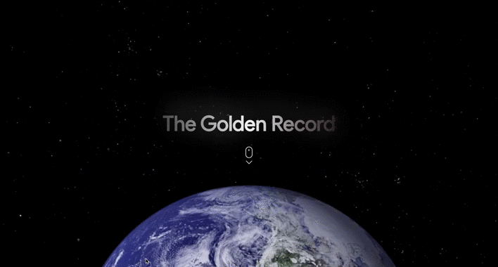

# The Golden Record - Web Documentary

## 🎓Disclaimer

This site has been created for educational purposes as part of the Bachelor's curriculum of the HETIC school. The contents presented have not been the subject of a request for right of use. **This site will and should in no case be used for commercial purposes and will not be published.**

## 🛰️ Project Overview
<p align="center">
  
</p>

**The Golden Record - Web Documentary** is a web experience on the most ambitious message sent into space. A gold-platted disk supposed to gives a better chance for future extraterrestrial intelligence life visitors to find out that we exist or once existed.

## 📄 Getting Started

### Live demo

Website is deployed [here](https://golden-record-webdoc.netlify.app)

### Installing

Clone the repository, and install the dependancies

```
git clone $url
```

```
cd WebDocVuejs
```

```
npm install
```

### Development Mode

```
npm run serve
```

Run the app in development mode
Open [http://localhost:8080/](http://localhost:8080/)

### Production Mode

```
npm run build
```

Builds the app for production to the build folder.

Your app is ready to be deployed.

### Lints and fixes files

```
npm run lint
```

## 🔨 Built with

VueJS - [documentation](https://vuejs.org/)  
Vue Moment - [documentation](https://github.com/brockpetrie/vue-moment)  
Vue Router - [documentation](https://router.vuejs.org/)  
Animate On Scroll - [documentation](https://michalsnik.github.io/aos/)

## 👥 Contributers

Bastien Paquier - [bastien17-dev](https://github.com/bastien17-dev)  
Quentin Grancher - [quentingrchr](https://github.com/quentingrchr)  
Thomas Ceglie - [kingtoto](https://github.com/kingtoto)  
Guillaume Rackler - [gRAKLECLER](https://github.com/gRAKLECLER)  
Reda Hamouche - [RedaHamouche](https://github.com/RedaHamouche)  
Quentin Trouvé - [quentintrouve](https://github.com/quentintrouve)
